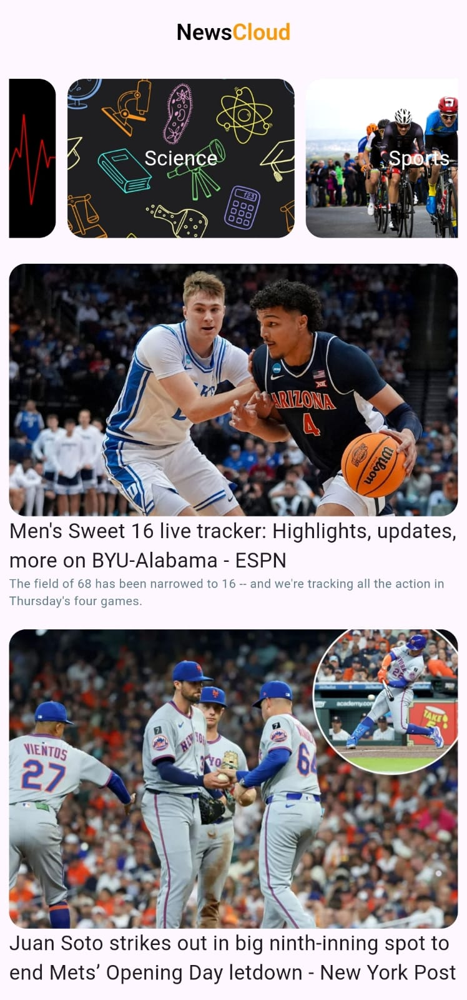

# News App 📰

A Flutter-based news application that fetches real-time data from RESTful APIs, implements dynamic UI components, and follows best practices for state management and error handling. Built as part of **Tharwat Samy's Flutter & Dart Development Course**.

[](https://drive.google.com/file/d/1K1ZZAhCUZBoFLC9NiHQiPwOFzQkCnwe5/view?usp=drive_link)
[](https://flutter.dev)
[](https://dart.dev)

---

## Features ✨
- **Dynamic UI**:  
  - `ListView.builder` for optimized scrolling with `BouncingScrollPhysics`.  
  - `CustomScrollView` and `SliverList` for complex layouts.  
  - Text truncation with `maxLines` and `overflow: TextOverflow.ellipsis`.  
  - Custom `BoxDecoration` for containers (border radius, images).  

- **API Integration**:  
  - RESTful API workflows using **Dio** (auto-JSON parsing).  
  - Secure authentication via API keys.  
  - Parameterized endpoints for data filtering.  

- **State Management**:  
  - Asynchronous data fetching using `FutureBuilder`.  
  - Lifecycle optimization with API calls in `initState`.  
  - Null-safety using `??`, `!`, and conditional rendering.  

- **Error Handling**:  
  - `try/catch` blocks for network exceptions.  
  - Loading indicators and UI feedback.  

---

## Screenshots 🖼️
| Home Screen | Category View | 
|-------------|---------------|
|  |  | 

---

## Installation 🛠️
1. **Clone the repository**:
   ```bash
   git clone https://github.com/osaamaahmeed/News-App.git

2. **Install dependencies**:
    ```bash
    flutter pub get
    ```
3. **Run the app**:
    ``` bash
    flutter run
    ```
---

## API Integration 🌐
Endpoints: Fetch news data using parameterized URLs (e.g., category filters).

Response Handling:
  ```dart
// Example using Dio
Future<List<NewsModel>> fetchNews() async {
  final response = await Dio().get('https://api.example.com/news');
  return (response.data as List).map((e) => NewsModel.fromJson(e)).toList();
}
  ```
JSON Parsing: Convert API responses to Dart objects using factory constructors:
  ``` dart
factory NewsModel.fromJson(Map<String, dynamic> json) {
  return NewsModel(
    title: json['title'],
    content: json['content'],
  );
}
  ```

---

## Project Structure 📂
``` bash
  lib/
├── models/           # Data classes (e.g., NewsModel)
├── services/         # API services (e.g., NewsService)
├── widgets/          # Reusable UI components
├── views/            # Screens (e.g., HomeScreen, CategoryScreen)
└── main.dart         # App entry point
```
---

## Key Learnings 🧠
- UI Optimization: Avoided Expanded in ListView by using SizedBox for fixed heights.

- Performance: Reduced rebuilds by separating logic into services/ and using shrinkWrap: true.

- Debugging: Leveraged VS Code breakpoints to resolve state issues.

---

## Acknowledgements

- Course Instructor: [Tharwat Samy](https://github.com/tharwatsamy)
- API Provider: [NewsAPI.org](https://newsapi.org/)


